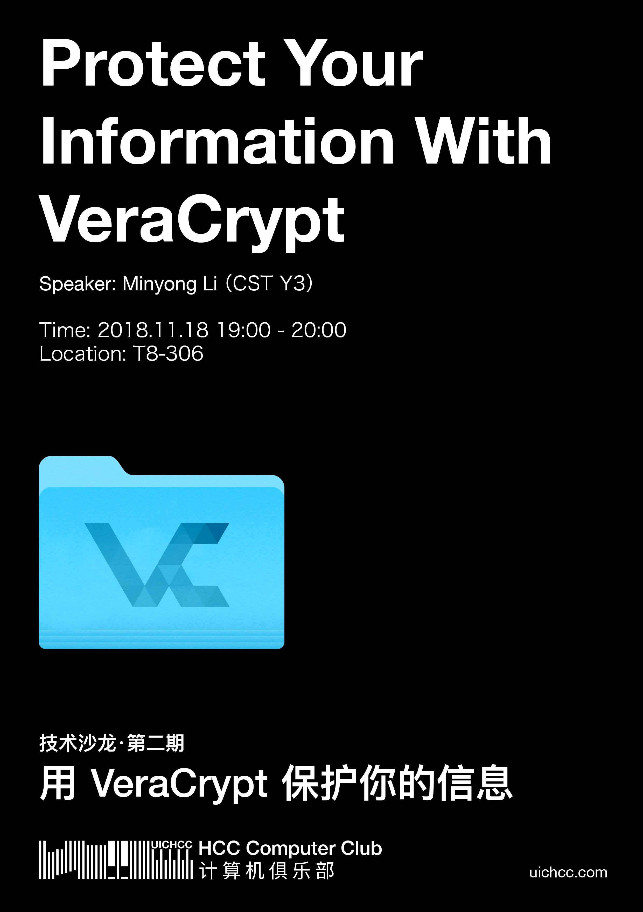

Topic: **Protect Your Information With VeraCrypt**

Speaker: Minyong Li (a.k.a. Junde Yhi) (`CST Year 3`)

Location: T8-306 (BNU-HKBU UIC)

Time: 2018.11.18 19:00-20:00

Abstract: The modern cryptography and corresponding tools has been empowering virturally everyone in the world to effectively protect their digitally stored data by just several mouse clicks. In this talk I will introduce VeraCrypt, a strong, state-of-the-art encryption software, which is proved to be unbreakable as long as you have a safe password. I will also talk about several ways to make use of VeraCrypt. In the end, I will talk about good ways to choose robust passwords.

Video: [YouTube](https://www.youtube.com/watch?v=N4fEOt821Ew)

