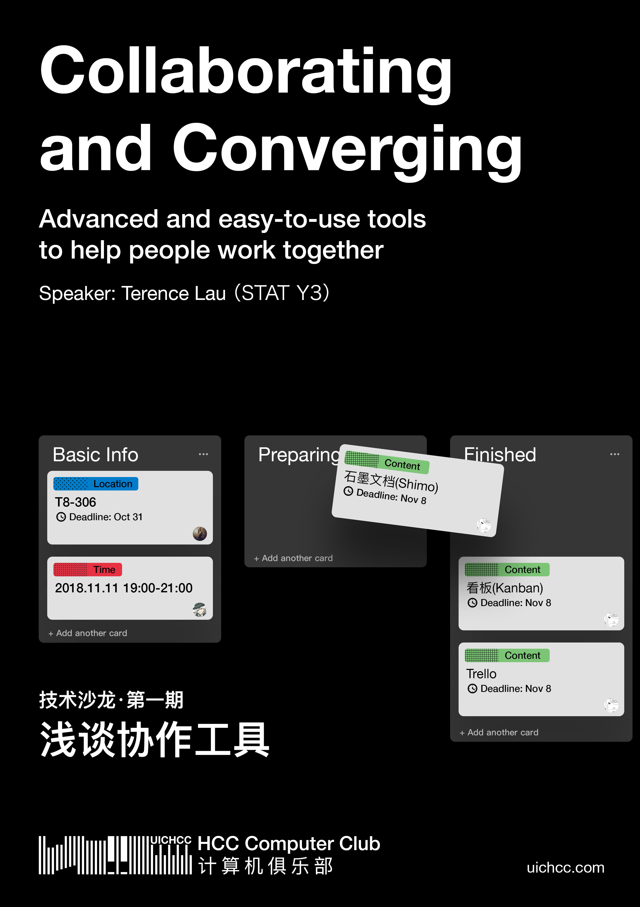

Topic: **Collaborating and Converging** 

Speaker: Terence Lau (`STAT Year 3`)

Location: T8-306 (BNU-HKBU UIC)

Time: 2018.11.11 20:00-21:00

Resources: [Slide](https://github.com/UICHCC/HCC-Lectures/tree/master/Collebarating-and-Coverging) (This slide is made with `reveal.js`, please download the whole folder and open the `index.html` to start.)

