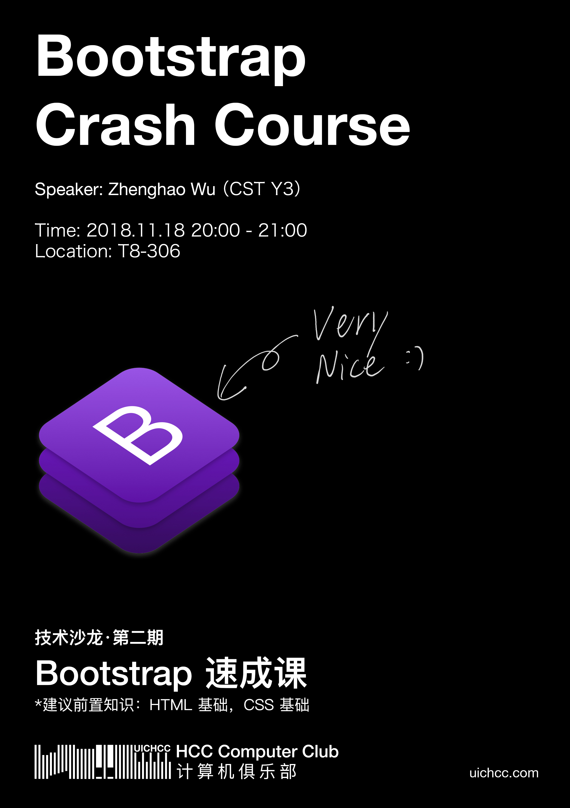

Topic: **Bootstrap Crash Course** 

Speaker: Zhenghao Wu (`CST Year 3`)

Location: T8-306 (BNU-HKBU UIC)

Time: 2018.11.18 20:00-21:00

> If you want to participate in this salon, I suggest you have the following knowledge: HTML fundamentals, basic knowledge of CSS.

Abstract: Bootstrap is an open source toolkit for developing with HTML, CSS, and JS. It is easy to use and has a modern and simple design. This course will introduce you to the features of Bootstrap 4 and help you apply Bootstrap to your own website or web application.

Resource: [Slide](https://github.com/UICHCC/HCC-Lectures/raw/master/Bootstrap-Crash-Course/Bootstrap-Crash-Course.pdf)

Video: [YouTube](https://www.youtube.com/watch?v=i253Zl7hTqg)

