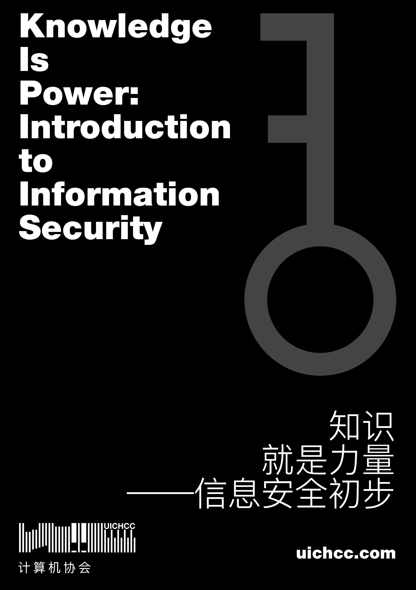

Topic: **Knowledge is Power: Introduction to Information Security**

Speaker: Junde Yhi (`CST Y3`)

Location: T29-106 (BNU-HKBU UIC)

Time: 2017.11.28

This is a lecture given by Junde Yhi on the Computer Carnival of BNU-HKBU UIC on November 28, 2017, introducing concepts of information security.

The provided [.md file](https://raw.githubusercontent.com/UICHCC/HCC-Lectures/master/Introduction-to-Information-Security/2017-11-28-knowledge-is-power-mdp.md) is a mdp file. You may use it to play the slides.

